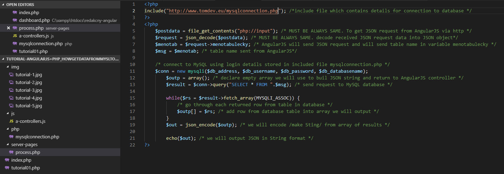

# angularjsphp-datafrommysql
AngularJS and PHP get data from MySQL database using JSON
 
<a target="_blank" href="http://www.tomdev.eu/tutorials/angularjsphp-datafrommysql-master/">DEMO</a>
<h1>How to get data from table in MySQL database to table in HTML format</h1>
<h2>AngularJS + PHP + MySQL</h2>

In this tutorial we will get data from any not empty table in MySQL database and we will output data into HTML table

We will use Angularjs to output data into tabe using ng-repeat directive in PHP page. We will use one .js file which will store angularjs controller and two php files.

First PHP file will be used as main page to output data from table in database. Second PHP file will contain PHP script which will process request , read data from choosen table, convert data to JSON (stringify) string and return data to controller. 
    Controller will request data from this PHP script as well.

 

1. - index.php - Create PHP page file with HTML code, import and use AngularJS, init some ng-app and main ng-controller.

<ul>In this case we used :
    <li>ng-app = "getdataApp"</li>
    <li>ng-controller = "mainController"</li>
</ul>
<ul>We will use files as follows:
    <li><strong>index.php</strong> - contains table output data</li>
    <li><strong>js/a-controllers.js</strong> - contain controller which send JSON request /table name in this case/ and get JSON response /data from requeted table/</li>
    <li><strong>server-pages/process.php</strong> - </li>
    <li><strong>php/mysqlconnection.php</strong> - contains login details for mysql database</li>
</ul>

Other files will look after data from requested table in database and controller will put data from database into scope's variable msg. We create table and using AngularJS 
    iteration by directive ng-repeat we will output data to table.

2. - mysqlconnection.php - Create this file which holds variables used to connect to MySQL database. Connection details.

3. a-controllers.js - AngularJS file initialize app and controller. Controller is responsible for sending name of requested table in JSON format to next PHP file 
    and receive data from requested table this is ensured using next PHP file which will return data in JSON format.

4. process.php - Server page which is not standart HTML file. This PHP handle JSON data sent from previous file. Connect to database and get requested data.
    Prepare table data to JSON format and return back to AngularJS controller which is defined in previous file.

5. SEE BELOW OUTPUT IMAGE - example output is below

